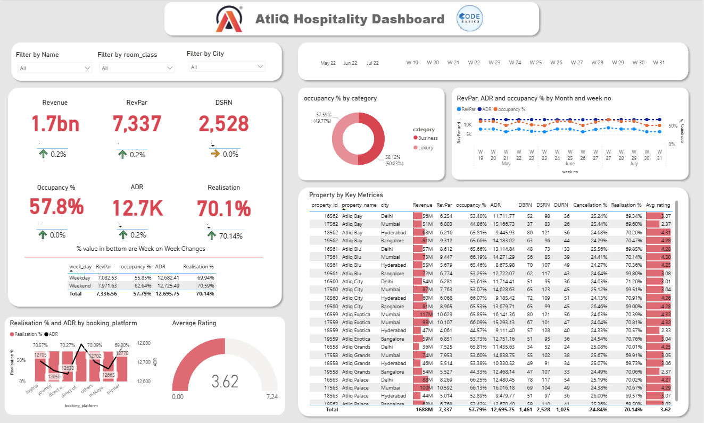

# Hospitality Revenue Analytics Dashboard

## Overview
Developed an interactive Power BI dashboard to analyze hospitality industry performance using key metrics such as Revenue, Occupancy Rate, ADR, and RevPAR.

## Tools Used
- Power BI
- DAX
- Power Query
- Excel

## Key Features
- Revenue Analysis
- Occupancy Rate Tracking
- ADR & RevPAR Monitoring
- Interactive KPI Visualizations

## Dashboard Preview

